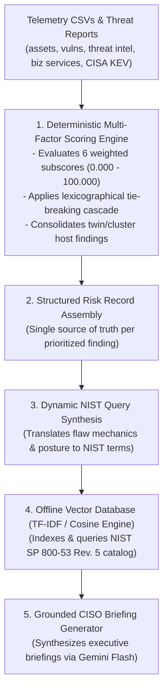

# TawasolPay Cyber Risk Prioritization Assistant

An executive-grade cyber risk prioritization system built for TawasolPay. 

The system ingests internal infrastructure telemetry, vulnerability scans, threat intelligence feeds, business service profiles, and the authoritative CISA KEV catalog. It calculates vulnerability rankings using a 6-factor deterministic model paired with a 12-tier tie-breaking cascade. The top-ranked findings are dynamically mapped to authoritative NIST SP 800-53 Rev. 5 controls via an offline vector similarity engine and synthesized into actionable CISO briefings using Gemini 1.5 Flash (with an offline deterministic fallback).

---

## 1. System Architecture

The pipeline enforces a strict separation between quantitative risk computation and semantic control retrieval:




---

## 2. Quantitative Scoring Calculation

The system calculates an audit-ready **Composite Risk Score** ($0.000 - 100.000$) using a 6-factor deterministic model:

$$\text{Composite Risk Score} = (0.25 \times S_{\text{CVSS}}) + (0.20 \times S_{\text{Exposure}}) + (0.20 \times S_{\text{Exploit}}) + (0.15 \times S_{\text{ThreatIntel}}) + (0.15 \times S_{\text{BizImpact}}) + (0.05 \times S_{\text{ControlGap}})$$

All composite and dimension scores are computed and displayed to three decimal places.

### Subscore Evaluation Details

* **1. Base Severity ($S_{\text{CVSS}}$, 25% Weight):**
  * Calculated as $\min(100.0, (\text{CVSS Base} / 10.0) \times 100.0)$.
  * Defaults to $50.000$ if CVSS telemetry is unrecorded.

* **2. Asset Exposure ($S_{\text{Exposure}}$, 20% Weight):**
  * Base: $100.000$ if `internet_exposed` is true; $25.000$ if internal.
  * Production Adjustment: $+10.000$ bonus if `environment == 'production'` (capped at $100.000$).
  * Fallback: Defaults to $50.000$ if exposure telemetry is missing.

* **3. Exploitability ($S_{\text{Exploit}}$, 20% Weight):**
  * **$100.000$**: Listed in CISA KEV with confirmed ransomware campaign use.
  * **$90.000$**: Listed in CISA KEV (active in-the-wild exploitation confirmed).
  * **$75.000$**: Functional/public exploit code available.
  * **$20.000$**: No public exploit / theoretical only.

* **4. Threat Intelligence ($S_{\text{ThreatIntel}}$, 15% Weight):**
  Evaluates active threat actor and campaign alignment against regional advisories:
  * Matched Campaign: $+40.0$ points.
  * Sector Alignment (Fintech, Banking, Financial, Payments): $+20.0$ points.
  * Regional Alignment (Middle East, Gulf, UAE, MENA): $+15.0$ points.
  * Ransomware Association: $+15.0$ points.
  * Exploit Maturity (Weaponized / Functional): $+10.0$ points.
  * **Confidence Multiplier:** Raw accumulated points are scaled by intelligence confidence ($\text{High} = 1.0$, $\text{Medium} = 0.7$, $\text{Low} = 0.4$) and capped at $100.000$. Unmatched CVEs evaluate to $0.000$.

* **5. Business Impact ($S_{\text{BizImpact}}$, 15% Weight):**
  Quantifies business criticality and organizational blast radius:
  * Service Criticality: $\text{Critical} = 100.0$, $\text{High} = 80.0$, $\text{Medium} = 50.0$, $\text{Low} = 25.0$.
  * Customer-Facing Posture: $+15.0$ points.
  * Revenue Impact Tier: $\text{Critical} = +20.0$, $\text{High} = +15.0$, $\text{Medium} = +10.0$, $\text{Low} = +5.0$.
  * Compliance Scope Additions: $\text{PCI DSS} = +10.0$, $\text{GDPR} = +5.0$, $\text{ISO 27001} = +5.0$, $\text{SOC 2} = +5.0$.
  * Total capped at $100.000$.

* **6. Compensating Control Gap ($S_{\text{ControlGap}}$, 5% Weight):**
  Evaluates missing defense-in-depth compensating controls:
  * **$100.000$**: `edr_installed == False` (critical endpoint blind spot).
  * **$10.000$**: `edr_installed == True` (compensating host defense active).
  * **$50.000$**: Missing or unrecorded EDR status.

---

## 3. Deterministic Tie-Breaking & Cluster Consolidation

### The Tie-Breaking Cascade
When multiple findings evaluate to identical composite scores, the system resolves ranking using a strict, 12-tiered lexicographical cascade:

1. **`composite_risk_score` (Descending):** Primary sort key. Higher calculated composite scores always rank higher.
2. **`_tie_kev` (Descending):** Listed in CISA KEV ($1 > 0$). Known exploited vulnerabilities take precedence.
3. **`_tie_rw` (Descending):** Confirmed ransomware campaign association ($1 > 0$).
4. **`_tie_exposed` (Descending):** Public internet reachability ($1 > 0$).
5. **`_tie_crit` (Descending):** Asset criticality level ($\text{Critical: 4} > \text{High: 3} > \text{Medium: 2} > \text{Low: 1}$).
6. **`_tie_pci` (Descending):** Financial compliance scope ($\text{PCI DSS: 1} > \text{Non-PCI/GDPR: 0}$). This ensures financial processing infrastructure ranks above customer authentication services during score ties.
7. **`_tie_rev` (Descending):** Direct revenue impact rating ($\text{Critical: 20} > \text{High: 15} > \text{Medium: 10} > \text{Low: 5}$).
8. **`_tie_conf` (Descending):** Threat intelligence confidence tier ($\text{High: 3} > \text{Medium: 2} > \text{Low: 1}$).
9. **`_tie_days` (Descending):** Window of exposure / days open (older unpatched flaws prioritize higher).
10. **`_tie_cvss` (Descending):** Underlying CVSS base score.
11. **`asset_id` (Ascending):** Stable alphanumeric asset fallback.
12. **`cve_clean` (Ascending):** Unique alphanumeric CVE fallback for strict audit reproducibility.

### Cluster-Aware Asset Consolidation
In clustered or high-availability environments, redundant nodes execute identical workloads. Rather than letting identical twin instances (e.g., `vpn-edge-01` and `vpn-edge-02` supporting `Remote Access`) consume multiple slots in the Top 5, the engine consolidates identical risks sharing the same CVE, service, and score. This surfaces redundant host badges without crowding out other critical business services.

---

## 4. Supporting Question 1: The Data Split

* **What data did you embed and why?**  
  The **NIST SP 800-53 Rev. 5 Control Catalog** was embedded into vector space. Unstructured regulatory documentation contains hundreds of controls with dense narrative prose, requirements statements, and operational discussions. Vector embeddings allow the engine to map diverse technical vulnerability descriptions (e.g., heap buffer overflows, session token leakage, remote authentication bypasses) directly to applicable control families without maintaining brittle, manual lookup tables.

* **What data did you query as structured records and why?**  
  The **asset inventory, vulnerability feeds, threat actor campaign mappings, CISA KEV records, and business services** were processed as structured relational records. These datasets contain discrete operational metrics (such as boolean exposure flags, integer exposure days, CVSS floats, and compliance scopes) that require deterministic arithmetic, filtering, and joins. Passing raw operational data to an embedding retriever or LLM would introduce hallucinations, scoring drift, and unverified rankings, whereas structured processing guarantees auditable calculation.

---

## 5. Supporting Question 2: Where It Goes Wrong

1. **Unregistered Zero-Days or Unlisted Exploits in Public Feeds:**  
   * **The Failure Mode:** If an actively exploited vulnerability has not yet received an official CVE ID or has not yet been cataloged by CISA KEV, the exploit subscore ($S_{\text{Exploit}}$) defaults to $20.000$. This causes an actively attacked asset to rank below a theoretical, high-CVSS finding.  
   * **Mitigation:** The engine incorporates threat intelligence campaign telemetry independently of KEV status. If an advisory references active weaponization or functional exploit code in the wild, the threat intelligence subscore ($S_{\text{ThreatIntel}}$) triggers, counterbalancing the absence of a formal KEV listing.

2. **Semantic Control Dilution (Vector Retrieval Collapse):**  
   * **The Failure Mode:** If the retrieval query includes generic security terms like *"vulnerability patch flaw remediation update"*, high-frequency controls like `SI-2 (Flaw Remediation)` can mathematically dominate cosine similarity across every finding, masking specialized controls such as `AC-12 (Session Termination)` for token theft or `AC-17 (Remote Access)` for authentication bypasses.  
   * **Mitigation:** Queries are dynamically structured around root technical flaw mechanics and protocol actions (e.g., session invalidation, credential rotation, memory boundary protection) rather than generic patching verbs, ensuring domain-specific control retrieval.

3. **Conflicting Telemetry Across Data Feeds:**  
   * **The Failure Mode:** A host listed as `internet_exposed: false` in `assets.csv` may be marked as `asset_exposure: external` in `vulnerabilities.csv. Resolving exposure incorrectly alters both the exposure subscore and the tie-breaking cascade.  
   * **Mitigation:** The ingestion pipeline enforces a documented hierarchy: asset inventory telemetry takes precedence as authoritative infrastructure ground truth, but unresolved flags fall back to the vulnerability feed with an audit record logged in the output interface.

---

## 6. Supporting Question 3: One Thing You Would Change

If given another day of development, the single most important improvement would be integrating an **asynchronous temporal threat correlation and Graph-based blast radius analyzer**:  
Currently, business criticality and revenue impact are evaluated on a per-asset basis using flat relational joins. In real-world enterprise infrastructure, low-criticality systems (such as internal jump boxes or staging servers) frequently share network pathways, active directory trusts, or database credentials with critical production services (such as payment processing). Replacing independent row evaluations with a directed graph (such as NetworkX or Neo4j) would allow the composite model to calculate *transitive exposure*—elevating a vulnerability on an unmonitored staging gateway if it provides an unsegmented lateral path into the payment cardholder data environment.

---

## 7. Configuration File (`.env`)

The repository includes a pre-configured `.env` file in the root directory. Open it and replace the placeholder with your actual Gemini API key:

```env
# Gemini API Configuration
GEMINI_API_KEY=your_actual_gemini_api_key_here
EMBEDDING_MODEL=text-embedding-004
LLM_MODEL=gemini-1.5-flash
```
---

## 8. Local Setup and Execution Guide

### Repository Directory Structure
```text
tawasolpay-risk-prioritization/
├── data/
│   ├── assets.csv
│   ├── vulnerabilities.csv
│   ├── threat_intelligence.csv
│   ├── business_services.csv
│   ├── remediation_guidance.csv
│   ├── known_exploited_vulnerabilities.csv
│   ├── NIST_SP-800-53_rev5_catalog_load.csv
│   └── synthetic_threat_report.md
├── src/
│   ├── ingest.py
│   ├── scorer.py
│   └── rag.py
├── .env
├── app.py
├── requirements.txt
└── README.md
```
## Local Setup & Execution Guide

### Steps

```bash
# 1. Clone the repository and enter the directory
git clone [https://github.com/JagadeeshKandula135/tawasolpay-risk-prioritization.git](https://github.com/JagadeeshKandula135/tawasolpay-risk-prioritization.git)
cd tawasolpay-risk-prioritization

# 2. Create and activate a virtual environment
python -m venv riskenv
# On Windows (PowerShell):
.\riskenv\Scripts\Activate.ps1
# On macOS/Linux:
# source riskenv/bin/activate

# 3. Install project dependencies
pip install -r requirements.txt

# 4. Open the pre-included .env file and update it with your actual Gemini API key
# (The file is already in the root directory; replace 'your_actual_gemini_api_key' with your key)

# 5. Start the Streamlit web application dashboard
python -m streamlit run app.py
```
